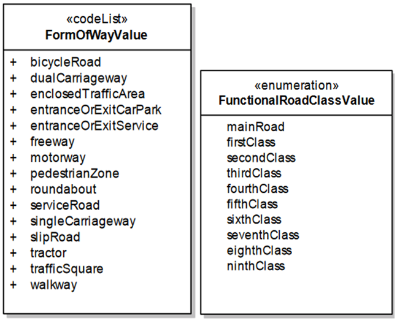

>According to INSPIRE data specification on transport networks (based on EuroRoads and GDF specifications), ‘form of way classification’ considers the physical properties of each road link (including accessible mobility modes), whereas ‘functional classification’ considers the importance of each road link within the road network. It is important to note that ‘form of way classification’ and ‘functional classification’ elements may vary in meaning across different European countries due to the lack of harmonization.

>Reference/additional info: https://inspire.ec.europa.eu/id/document/tg/tn

