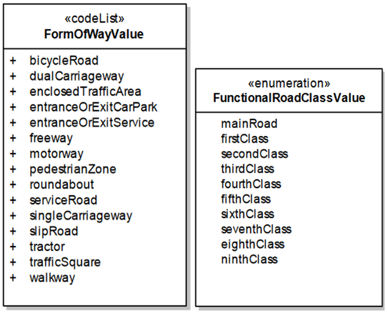

>According to ETSI TS 102 894-2 (DE=RoadType), road types are distinguished based on two parameters: (a) urban versus non-urban roads and (b) roads with versus without structural separation to opposite lanes.

>An extended **classification** is provided by the INSPIRE data specification on transport networks (based on EuroRoads and GDF specifications). This classification is based on: (a) ‘form of way’ that considers the physical properties of each road link (including accessible mobility modes) and (b) ‘functional class’ indicating the importance of each road link within the road network. It is important to note that the ‘form of way’ and ‘functional class’ elements may vary in meaning across different European countries due to the lack of harmonization.

>NOTE: The classification of road links is an important aspect to be considered by navigation systems. For example, in certain contexts, main or first-class roads may preferably be used for long-distance traffic (e.g., international traffic), while the lower classes in this hierarchy may preferably be used for regional and local traffic.

>Reference/additional info: https://www.etsi.org/deliver/etsi_ts/102800_102899/10289402/01.03.01_60/ts_10289402v010301p.pdf; https://inspire.ec.europa.eu/id/document/tg/tn

