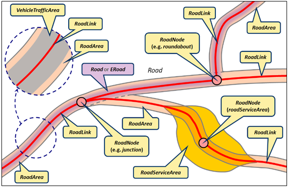

>Considering that road network nodes may be used for technical reasons, e.g., defining an additional/separate road link between two positions that exhibit different physical attributes (e.g., substantially different road width or higher/lower number of lanes), junctions may be addressed in a separate manner as decision/choice nodes through which traffic can be diverted to another route.

>The relationship of a given junction with the remaining network can be expressed via the indication of the whether it is a start/end junction of a given link.

>Reference/additional info: https://inspire.ec.europa.eu/id/document/tg/tn

