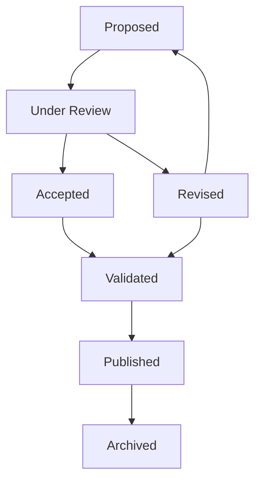

# 🛠️ Definition Processing Workflow

A structured workflow for capturing, enriching, reviewing, validating, and publishing semantic definitions with precision and version control.

---

## 🔁 Status Labels & Transition Logic

| Status         | Description                                  | Transition Flow                                                   |
|----------------|----------------------------------------------|-------------------------------------------------------------------|
| `proposed`     | Initial definition captured for enrichment   | Raw input ➝ ready for semantic refinement                         |
| `under review` | Being peer-reviewed or expert-evaluated      | Submitted after enrichment for feedback                          |
| `accepted`     | Reviewer approved without edits              | No changes recommended ➝ accepted                                 |
| `revised`      | Updated based on review feedback             | Edited after peer suggestions                                     |
| `validated`    | Officially endorsed and ready to publish     | Formally approved after final validation                         |
| `archived`     | Deprecated or replaced concept               | Marked as obsolete or superseded                                 |
| `unclassified` | No status assigned or unclear status         | Temporary placeholder during ingestion                           |

## 🧮 Example Metadata Block and Following Notes

```markdown
---
id: road-network--physical-attributes_road-width_2
label: road width
definition: the minimum information required for indicating the width of a road network’s links.
category: Types of data on infrastructure
language: en
status: under review
source: DR_EU_2022-670
subcategory:
  - Road network links and their physical attributes
---

>This information is addressed as encompassing in a discretized and systematic manner the width of various (maintained) components of the road surface, including driving lanes, hard shoulders, medians, parking space, and the roadside.
```

---

## 📥 1. Initial Capture

- Source definitions from trusted materials.
- Assign status → `proposed`.
- Create metadata fields:  
  `source`, `category`, `subcategory`, `id`, `definition`, `status`.

## 🔧 2. Semantic Enrichment

### 🔍 Refinement Tasks

- Reword for precision and clarity.
- Normalize terminology to domain standards.

### 📝 Explanatory Additions

- Provide background context.
- Include example usage and edge cases.
- Clarify assumptions or constraints.
- Add visual aids or code samples when helpful.

## 👥 3. Peer Review Workflow

- Change status to → `under review`.
- Reviewers may suggest edits or approve.
- Resulting status becomes:
  - `accepted` if approved as-is
  - `revised` if edits are applied
  - `proposed` if rejected

Track revisions via commit history or comments in issues.

## ✅ 4. Validation Cycle

- Submit `accepted` or `revised` items.
- Upon confirmation → status becomes `validated`.
- Rejected entries return to `proposed` for revision.

## 🌍 5. Publishing & Discovery

- Release finalized definitions → `release/DR_*.md`
- Generate semantic vocab → `vocab/<DR>/<item>.ttl`
- Publish via GitHub Actions as versioned artifacts.

## 🔄 6. Change Management

- Any update starts from status → `proposed`.
- Maintain changelog entries per definition.
- Retired concepts receive status → `archived`.
- Track rollback versions via git history.

## 🧰 Recommended Tooling

| Step               | Tools & Format                              |
|--------------------|---------------------------------------------|
| Metadata capture    | Markdown, YAML frontmatter                  |
| Semantic refinement | Terminology linting, text editors           |
| Review process      | GitHub pull requests, markdown comments     |
| Approval cycle      | GitHub issues, labels, validation workflows |
| Publishing          | GitHub Actions, release tags                |
| Logging changes     | Semantic changelog generator                |

## 🌐 Visual Workflow


